Homework5: Factor and figure management
================
Jummy David
October 19, 2018

-   [PART1: Factor management:](#part1-factor-management)
    -   [Original `gapminder` dataset](#original-gapminder-dataset)
    -   [Drop Oceania](#drop-oceania)
    -   [Here we are dropping the `Oceania` level from the filtered data.](#here-we-are-dropping-the-oceania-level-from-the-filtered-data.)
-   [PART2: File I/O:](#part2-file-io)
    -   [Write and read the `Gap` data frame as a `csv`.](#write-and-read-the-gap-data-frame-as-a-csv.)
    -   [Write and read the `Gap` data as `RDS`:](#write-and-read-the-gap-data-as-rds)
    -   [Write and read the `Gap` data frame using `dput`:](#write-and-read-the-gap-data-frame-using-dput)
-   [PART3: Visualization design:](#part3-visualization-design)
    -   [Replotting the ordered data here.](#replotting-the-ordered-data-here.)
    -   [Making the plot look better](#making-the-plot-look-better)
    -   [Convert `gg2_plot` to a `plotly` graph](#convert-gg2_plot-to-a-plotly-graph)
-   [PART4: Writing figures to file:](#part4-writing-figures-to-file)
    -   [Use `ggplotly` to write a figure to file](#use-ggplotly-to-write-a-figure-to-file)
    -   [Use `ggsave` to write a figure to file](#use-ggsave-to-write-a-figure-to-file)
    -   [Explicit provision of the plot object `gg2_plot`.](#explicit-provision-of-the-plot-object-gg2_plot.)
-   [But I want to do more: Deeper exploration of the forcats packages](#but-i-want-to-do-more-deeper-exploration-of-the-forcats-packages)
    -   [`fct_infreq()`](#fct_infreq)
    -   [`fct_rev()`](#fct_rev)
    -   [`fct_reorder2()`](#fct_reorder2)
    -   [`fct_relevel()`](#fct_relevel)
    -   [`fct_recode()`](#fct_recode)
    -   [`fct_collapse()`](#fct_collapse)
    -   [`fct_lump()`](#fct_lump)
-   [References:](#references)

In this homework, we will reorder a factor in a principled way based on the `gapminder` data and demonstrate the effect in arranged data and in figures. We will write some data to file and load it back into R. We will also improve a figure (or make one from scratch), using new knowledge, e.g., control the color scheme, use factor levels, smoother mechanics. Make a plotly visual and implement visualization design principles.

To start with, load the necessary R packages as in below.

``` r
suppressPackageStartupMessages(library(tidyverse))
```

    ## Warning: package 'readr' was built under R version 3.3.2

    ## Warning: package 'purrr' was built under R version 3.3.2

    ## Warning: package 'dplyr' was built under R version 3.3.2

``` r
suppressPackageStartupMessages(library(gapminder))
```

    ## Warning: package 'gapminder' was built under R version 3.3.2

``` r
suppressPackageStartupMessages(library(gridExtra))
```

    ## Warning: package 'gridExtra' was built under R version 3.3.2

``` r
suppressPackageStartupMessages(library(dplyr))
suppressPackageStartupMessages(library(ggplot2))
suppressPackageStartupMessages(library(forcats))
suppressPackageStartupMessages(library(knitr))
library(scales)
```

    ## Warning: package 'scales' was built under R version 3.3.2

    ## 
    ## Attaching package: 'scales'

    ## The following object is masked from 'package:purrr':
    ## 
    ##     discard

    ## The following object is masked from 'package:readr':
    ## 
    ##     col_factor

``` r
library(listviewer)
library(plotly)
```

    ## 
    ## Attaching package: 'plotly'

    ## The following object is masked from 'package:ggplot2':
    ## 
    ##     last_plot

    ## The following object is masked from 'package:stats':
    ## 
    ##     filter

    ## The following object is masked from 'package:graphics':
    ## 
    ##     layout

PART1: Factor management:
-------------------------

I decided to go for `gapminder` dataset. I have shown the first few rows to remind myself of how the dataset look like.

``` r
head(gapminder) %>%
  knitr::kable()
```

| country     | continent |  year|  lifeExp|       pop|  gdpPercap|
|:------------|:----------|-----:|--------:|---------:|----------:|
| Afghanistan | Asia      |  1952|   28.801|   8425333|   779.4453|
| Afghanistan | Asia      |  1957|   30.332|   9240934|   820.8530|
| Afghanistan | Asia      |  1962|   31.997|  10267083|   853.1007|
| Afghanistan | Asia      |  1967|   34.020|  11537966|   836.1971|
| Afghanistan | Asia      |  1972|   36.088|  13079460|   739.9811|
| Afghanistan | Asia      |  1977|   38.438|  14880372|   786.1134|

### Original `gapminder` dataset

To ensure that the variables I'm exploring are indeed factors, we will do some general check before manipulation.

From the code below, obviously variables `continent` and `country` are the only two factors in the gapminder dataset. Variable `continent` is a factor with 5 levels, while variable `country` is factor with 142 levels. With other variables being numeric and integer.

``` r
gapminder %>% #has 17404 rows with continent having 5 levels
  str() #shows the structure of the dataset
```

    ## Classes 'tbl_df', 'tbl' and 'data.frame':    1704 obs. of  6 variables:
    ##  $ country  : Factor w/ 142 levels "Afghanistan",..: 1 1 1 1 1 1 1 1 1 1 ...
    ##  $ continent: Factor w/ 5 levels "Africa","Americas",..: 3 3 3 3 3 3 3 3 3 3 ...
    ##  $ year     : int  1952 1957 1962 1967 1972 1977 1982 1987 1992 1997 ...
    ##  $ lifeExp  : num  28.8 30.3 32 34 36.1 ...
    ##  $ pop      : int  8425333 9240934 10267083 11537966 13079460 14880372 12881816 13867957 16317921 22227415 ...
    ##  $ gdpPercap: num  779 821 853 836 740 ...

``` r
nlevels(gapminder$continent) #number of levels
```

    ## [1] 5

``` r
levels(gapminder$continent) #name of levels
```

    ## [1] "Africa"   "Americas" "Asia"     "Europe"   "Oceania"

The code here gives the maximum GDP per capita for each continent before removing Oceania. We see here that the default `R` arranged the maximum GDP per capita alphabetically. The violin plot below is also arranged alphabetically.

``` r
Orig_gap <- gapminder %>%
  group_by(continent) %>%
  summarise(max = max(gdpPercap)) 

knitr::kable(Orig_gap)
```

| continent |        max|
|:----------|----------:|
| Africa    |   21951.21|
| Americas  |   42951.65|
| Asia      |  113523.13|
| Europe    |   49357.19|
| Oceania   |   34435.37|

``` r
gapminder %>% #Plot the original gapminder with no arrange
  ggplot(aes(continent, gdpPercap, fill = continent)) +
  scale_y_log10() +
  geom_violin() +
  labs(x="Continent", y = "GDP per capita") +
  ggtitle("GDP per capita by continent")+theme(plot.title = element_text(hjust = 0.5))
```

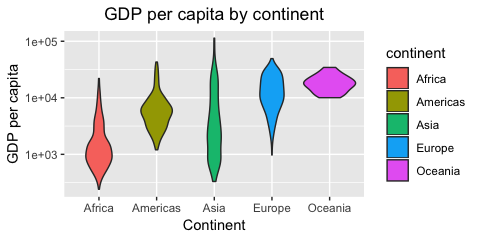

#### Exploring the effect of `arrange()` on the original `gapminder` dataset

The chunk code here arranged GDP per capita of each continent in increasing order. We can obviously see that Africa has the lowest GDP per capita, while Asia has the highest from the table. But the figure after arranging is not different from the default arrangement. The command `arrange` has no effect on the figure but thus arrange the table.

``` r
Gap_arrange <- gapminder %>% 
  group_by(continent) %>%
  summarise(max = max(gdpPercap)) %>%
  arrange(max)
```

    ## Warning: package 'bindrcpp' was built under R version 3.3.2

``` r
knitr::kable(Gap_arrange)
```

| continent |        max|
|:----------|----------:|
| Africa    |   21951.21|
| Oceania   |   34435.37|
| Americas  |   42951.65|
| Europe    |   49357.19|
| Asia      |  113523.13|

``` r
gapminder %>%
  group_by(continent) %>%
  mutate(max = max(gdpPercap)) %>% #reorder by mean
  arrange(max) %>%
  ggplot(aes(continent, gdpPercap, fill = continent)) +
  scale_y_log10() +
  geom_violin() +
  labs(x="Continent", y = "GDP per capita") +
  ggtitle("GDP per capita by continent")+theme(plot.title = element_text(hjust = 0.5))
```


Here we see that the 5 levels and their names are preserved.

``` r
Gap_arrange %>% #continent having 5 levels is preserved
  str() #shows the structure of the dataset
```

    ## Classes 'tbl_df', 'tbl' and 'data.frame':    5 obs. of  2 variables:
    ##  $ continent: Factor w/ 5 levels "Africa","Americas",..: 1 5 2 4 3
    ##  $ max      : num  21951 34435 42952 49357 113523

``` r
nlevels(Gap_arrange$continent) #number of levels
```

    ## [1] 5

``` r
levels(Gap_arrange$continent) #name of levels
```

    ## [1] "Africa"   "Americas" "Asia"     "Europe"   "Oceania"

#### Exploring the effect of `reodering` a factor on the original gapminder dataset

The chunk code here reordered GDP per capita of each continent in increasing order. We can obviously see that Africa has the lowest GDP per capita, while Asia has the highest from the table as in the case of `arrange`. Also, the figure after `fct_reorder` is different from the default arrangement. The command `fct_reorder` has an effect on the figure and thus reordered the plot according to the maximum GDP per capita.

``` r
Gap_reorder <- gapminder %>%
  mutate(continent = fct_reorder(continent, gdpPercap, .fun = max)) %>%
  group_by(continent) %>%
  summarise(max = max(gdpPercap)) 

knitr::kable(Gap_reorder)
```

| continent |        max|
|:----------|----------:|
| Africa    |   21951.21|
| Oceania   |   34435.37|
| Americas  |   42951.65|
| Europe    |   49357.19|
| Asia      |  113523.13|

``` r
gapminder %>%
  mutate(continent = fct_reorder(continent, gdpPercap, .fun = max)) %>% #reorder by mean
  ggplot(aes(continent, gdpPercap, fill = continent)) +
  scale_y_log10() +
  geom_violin() +
  labs(x="Continent", y = "GDP per capita") +
  ggtitle("GDP per capita by continent")+theme(plot.title = element_text(hjust = 0.5))
```

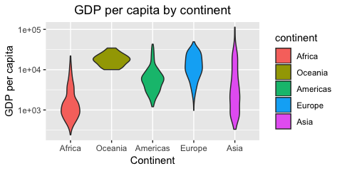

``` r
Gap_reorder %>% #the continent having 5 levels is preserved
  str() #shows the structure of the dataset
```

    ## Classes 'tbl_df', 'tbl' and 'data.frame':    5 obs. of  2 variables:
    ##  $ continent: Factor w/ 5 levels "Africa","Oceania",..: 1 2 3 4 5
    ##  $ max      : num  21951 34435 42952 49357 113523

``` r
nlevels(Gap_reorder$continent) #number of levels
```

    ## [1] 5

``` r
levels(Gap_reorder$continent) #name of levels
```

    ## [1] "Africa"   "Oceania"  "Americas" "Europe"   "Asia"

### Drop Oceania

``` r
table(gapminder$continent) #let us see the table of levels in factor continent before removing the rows. Here we see that Oceania has 24 observations before filtering.
```

    ## 
    ##   Africa Americas     Asia   Europe  Oceania 
    ##      624      300      396      360       24

#### Here we are filtering out Oceania.

``` r
#select_continent <- c("Africa", "Americas", "Asia", "Europe")
Gap_select <- gapminder %>%
  filter(continent != "Oceania")

Gap_select %>% #has 1680 observations with continent having 5 levels and country with 142 levels.
  str()
```

    ## Classes 'tbl_df', 'tbl' and 'data.frame':    1680 obs. of  6 variables:
    ##  $ country  : Factor w/ 142 levels "Afghanistan",..: 1 1 1 1 1 1 1 1 1 1 ...
    ##  $ continent: Factor w/ 5 levels "Africa","Americas",..: 3 3 3 3 3 3 3 3 3 3 ...
    ##  $ year     : int  1952 1957 1962 1967 1972 1977 1982 1987 1992 1997 ...
    ##  $ lifeExp  : num  28.8 30.3 32 34 36.1 ...
    ##  $ pop      : int  8425333 9240934 10267083 11537966 13079460 14880372 12881816 13867957 16317921 22227415 ...
    ##  $ gdpPercap: num  779 821 853 836 740 ...

``` r
table(Gap_select$continent) #after removing the rows/filtering, the rows in Oceania are gone but the level Oceania is still present. 
```

    ## 
    ##   Africa Americas     Asia   Europe  Oceania 
    ##      624      300      396      360        0

``` r
nlevels(Gap_select$continent) #the code here shows we have 5 levels
```

    ## [1] 5

``` r
levels(Gap_select$continent) #the code here shows Oceania is still part of the levels and hasn't been dropped
```

    ## [1] "Africa"   "Americas" "Asia"     "Europe"   "Oceania"

``` r
unique(Gap_select$continent)
```

    ## [1] Asia     Europe   Africa   Americas
    ## Levels: Africa Americas Asia Europe Oceania

#### The effect of filtering out Oceania on the table and figure.

The filtered data before arranging by continent. Even though the structure of the data showed all the 5 levels, the table and the figure did not keep the level Oceania. The table and the figure filtered out Oceania but the level is still kept in the structure.

``` r
gapminder %>% #no Oceania here
  filter(continent != "Oceania") %>%
  group_by(continent) %>%
  summarise(max = max(gdpPercap)) %>%
  knitr::kable()
```

| continent |        max|
|:----------|----------:|
| Africa    |   21951.21|
| Americas  |   42951.65|
| Asia      |  113523.13|
| Europe    |   49357.19|

``` r
gapminder %>% #no Oceania here as well
  filter(continent != "Oceania") %>% #Plot the filtered data with no arrange
  ggplot(aes(continent, gdpPercap, fill = continent)) +
  scale_y_log10() +
  geom_violin() +
  labs(x="Continent", y = "GDP per capita") +
  ggtitle("GDP per capita by continent")+theme(plot.title = element_text(hjust = 0.5))
```

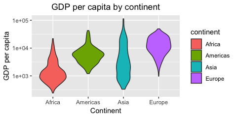

#### Now `arrange` the filtered data by maximum GDP per capita

Here the command `arrange` thus arrange the continent according to the maximum GDP per capita.

``` r
gapminder %>% #the code here actually arranged the data by the maximum GDP per capita
  filter(continent != "Oceania") %>%
  group_by(continent) %>%
  summarise(max = max(gdpPercap)) %>%
  arrange(max) %>%
  knitr::kable()
```

| continent |        max|
|:----------|----------:|
| Africa    |   21951.21|
| Americas  |   42951.65|
| Europe    |   49357.19|
| Asia      |  113523.13|

``` r
gapminder %>% #Here, arranged did nothing to the figure. It give the same figure as the one without arrange
  filter(continent != "Oceania") %>%
  group_by(continent) %>%
  mutate(max = max(gdpPercap)) %>% #reorder by mean
  arrange(max) %>%
  ggplot(aes(continent, gdpPercap, fill = continent)) +
  scale_y_log10() +
  geom_violin() +
  labs(x="Continent", y = "GDP per capita") +
  ggtitle("GDP per capita by continent")+theme(plot.title = element_text(hjust = 0.5))
```


#### Exploring the effect of `reodering` a factor on the filtered data

The chunk code here reordered GDP per capita of each continent in increasing order. We can obviously see that Africa has the lowest GDP per capita, while Asia has the highest from the table as in the case of `arrange`. Also, the figure after `fct_reorder` is different from the default arrangement. The command `fct_reorder` has an effect on both the table and the figure and thus reordered the plot according to the maximum GDP per capita. The table and the plot give the same information as per their arrangement.

``` r
Gap_re <- gapminder %>% #the code here actually arranged the data by the maximum GDP per capita
  filter(continent != "Oceania") %>%
  mutate(continent = fct_reorder(continent, gdpPercap, .fun = max)) %>%
  group_by(continent) %>%
  summarise(max = max(gdpPercap))


  knitr::kable(Gap_re)
```

| continent |        max|
|:----------|----------:|
| Africa    |   21951.21|
| Americas  |   42951.65|
| Europe    |   49357.19|
| Asia      |  113523.13|

``` r
  str(Gap_re) #we see that reordering a filtered data still preserved the levels
```

    ## Classes 'tbl_df', 'tbl' and 'data.frame':    4 obs. of  2 variables:
    ##  $ continent: Factor w/ 5 levels "Africa","Americas",..: 1 2 3 4
    ##  $ max      : num  21951 42952 49357 113523

``` r
gapminder %>% #Here, reorder changed the arrangement of the figure. It gives a different figure in the order of maximum GDP per capita 
  filter(continent != "Oceania") %>%
  mutate(continent = fct_reorder(continent, gdpPercap, .fun = max)) %>% #reorder by maximum GDP per capita
  ggplot(aes(continent, gdpPercap, fill = continent)) +
  scale_y_log10() +
  geom_violin() +
  labs(x="Continent", y = "GDP per capita") +
  ggtitle("GDP per capita by continent")+theme(plot.title = element_text(hjust = 0.5))
```

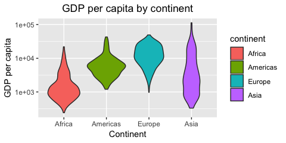

### Here we are dropping the `Oceania` level from the filtered data.

Here we have dropped Oceania from the filtered data.

``` r
Gap_select_levels <- gapminder %>%
  filter(continent != "Oceania") %>%
  droplevels()

Gap_select_levels %>% #has 1680 rows with continent having 4 levels
  str()
```

    ## Classes 'tbl_df', 'tbl' and 'data.frame':    1680 obs. of  6 variables:
    ##  $ country  : Factor w/ 140 levels "Afghanistan",..: 1 1 1 1 1 1 1 1 1 1 ...
    ##  $ continent: Factor w/ 4 levels "Africa","Americas",..: 3 3 3 3 3 3 3 3 3 3 ...
    ##  $ year     : int  1952 1957 1962 1967 1972 1977 1982 1987 1992 1997 ...
    ##  $ lifeExp  : num  28.8 30.3 32 34 36.1 ...
    ##  $ pop      : int  8425333 9240934 10267083 11537966 13079460 14880372 12881816 13867957 16317921 22227415 ...
    ##  $ gdpPercap: num  779 821 853 836 740 ...

``` r
table(Gap_select_levels$continent) #no more Oceania
```

    ## 
    ##   Africa Americas     Asia   Europe 
    ##      624      300      396      360

``` r
nlevels(Gap_select_levels$continent) #we now have 4 levels
```

    ## [1] 4

``` r
levels(Gap_select_levels$continent) #Oceania is no more among the levels' name
```

    ## [1] "Africa"   "Americas" "Asia"     "Europe"

``` r
unique(Gap_select_levels$continent)
```

    ## [1] Asia     Europe   Africa   Americas
    ## Levels: Africa Americas Asia Europe

``` r
Gap_select_levels %>% #this gives the default plot of the data after dropping Oceania
  group_by(continent) %>%
  mutate(max = max(gdpPercap)) %>% 
  ggplot(aes(continent, gdpPercap, fill = continent)) +
  scale_y_log10() +
  geom_violin() +
  labs(x="Continent", y = "GDP per capita") +
  ggtitle("GDP per capita by continent")+theme(plot.title = element_text(hjust = 0.5))
```


#### `arrange` the dataset after dropping oceania by continent

Again, arrange does nothing to the figure but rearranged the table according to the maximum GDP per capita

``` r
Gap_select_levels %>%
  group_by(continent) %>%
  summarise(max = max(gdpPercap)) %>%
  arrange(max) %>%
  knitr::kable()
```

| continent |        max|
|:----------|----------:|
| Africa    |   21951.21|
| Americas  |   42951.65|
| Europe    |   49357.19|
| Asia      |  113523.13|

``` r
Gap_select_levels %>%
  group_by(continent) %>%
  mutate(max = max(gdpPercap)) %>% #reorder by mean
  arrange(max) %>%
  ggplot(aes(continent, gdpPercap, fill = continent)) +
  scale_y_log10() +
  geom_violin() +
  labs(x="Continent", y = "GDP per capita") +
  ggtitle("GDP per capita by continent")+theme(plot.title = element_text(hjust = 0.5))
```


#### Reorder the levels of continent

Here, we reoredered by the maximum GDP per capita and standard deviation of GDP per capita beyong the most basic choice of the median. In conclusion, we see that the alphabetical order is preserved in figure when `arrange` is used which may not be what we want. So, if we are to arrange factors in our way, it is always advisable to use `fct_reorder`.

``` r
Gap_select_levels %>% #the table is also reordered by the maximum GDP per capita
  mutate(continent = fct_reorder(continent, gdpPercap, .fun = max)) %>%
  group_by(continent) %>%
  summarise(max = max(gdpPercap)) %>%
  knitr::kable()
```

| continent |        max|
|:----------|----------:|
| Africa    |   21951.21|
| Americas  |   42951.65|
| Europe    |   49357.19|
| Asia      |  113523.13|

``` r
#Reorder by the maximum of the variable gdpPercap
Gap_select_levels %>%
  mutate(continent = fct_reorder(continent, gdpPercap, .fun = max)) %>% #reorder by mean
  ggplot(aes(continent, gdpPercap, fill = continent)) +
  scale_y_log10() +
  geom_violin() +
  labs(x="Continent", y = "GDP per capita") +
  ggtitle("GDP per capita by continent")+theme(plot.title = element_text(hjust = 0.5))
```


``` r
Gap_select_levels %>% #Here we used a different plot type (boxplot) to see if we will have a similar result
  mutate(continent = fct_reorder(continent, gdpPercap, .fun = max)) %>%
  ggplot(aes(continent, gdpPercap, fill = continent)) +
  geom_boxplot() +
  scale_y_log10() +
  labs(x="Continent", y = "GDP per capita") +
  ggtitle("GDP per capita by continent")+theme(plot.title = element_text(hjust = 0.5))
```

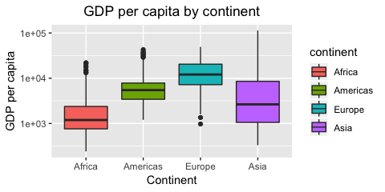

``` r
#Reorder by the standard deviation of the variable gdpPercap
Gap_select_levels %>%
  mutate(continent = fct_reorder(continent, gdpPercap, .fun = sd)) %>% #reorder by sd
  ggplot(aes(continent, gdpPercap, fill = continent)) +
  scale_y_log10() +
  geom_violin() +
  labs(x="Continent", y = "GDP per capita") +
  ggtitle("GDP per capita by continent")+theme(plot.title = element_text(hjust = 0.5))
```


PART2: File I/O:
----------------

Here we create a new dataset from gapminder by selecting one country from each continent. We make a point and violin plot of life expectancy by continent.

``` r
sel_countries <- c("Nigeria", "Australia", "Canada", "Austria", "China" ) #the code here group the country we want to select
Gap_sel <- gapminder %>%
  filter(country %in% sel_countries) %>% #the code filters all countries to only selected countries
  droplevels() #we drop the filtered levels

Gap_sel %>% head %>% knitr::kable()
```

| country   | continent |  year|  lifeExp|       pop|  gdpPercap|
|:----------|:----------|-----:|--------:|---------:|----------:|
| Australia | Oceania   |  1952|    69.12|   8691212|   10039.60|
| Australia | Oceania   |  1957|    70.33|   9712569|   10949.65|
| Australia | Oceania   |  1962|    70.93|  10794968|   12217.23|
| Australia | Oceania   |  1967|    71.10|  11872264|   14526.12|
| Australia | Oceania   |  1972|    71.93|  13177000|   16788.63|
| Australia | Oceania   |  1977|    73.49|  14074100|   18334.20|

``` r
ggplot(Gap_sel, aes(lifeExp, country)) + #note that the plot here is in alphabetical order from Australia to Nigeria.
  geom_point() +
  labs(x="Life expectancy", y = "Country") +
  ggtitle("Life expectancy by country")+theme(plot.title = element_text(hjust = 0.5))
```

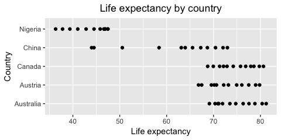

``` r
Gap_sel %>% #note that the plot is also in alphabetical order from Australia to Nigeria.
  ggplot(aes(country, lifeExp, fill = country)) +
  scale_y_log10() +
  geom_violin() +
  labs(x="Country", y = "Life expectancy") +
  ggtitle("GDP per capita by country")+theme(plot.title = element_text(hjust = 0.5))
```

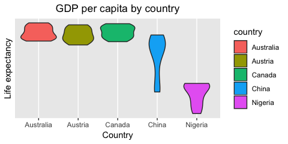

Here we reordered by maximum life expectancy.

``` r
Gap <- Gap_sel %>%
  mutate(country = fct_reorder(country, lifeExp, .fun = max)) #reorder by the mean life expectancy

knitr::kable(Gap)
```

| country   | continent |  year|   lifeExp|         pop|   gdpPercap|
|:----------|:----------|-----:|---------:|-----------:|-----------:|
| Australia | Oceania   |  1952|  69.12000|     8691212|  10039.5956|
| Australia | Oceania   |  1957|  70.33000|     9712569|  10949.6496|
| Australia | Oceania   |  1962|  70.93000|    10794968|  12217.2269|
| Australia | Oceania   |  1967|  71.10000|    11872264|  14526.1246|
| Australia | Oceania   |  1972|  71.93000|    13177000|  16788.6295|
| Australia | Oceania   |  1977|  73.49000|    14074100|  18334.1975|
| Australia | Oceania   |  1982|  74.74000|    15184200|  19477.0093|
| Australia | Oceania   |  1987|  76.32000|    16257249|  21888.8890|
| Australia | Oceania   |  1992|  77.56000|    17481977|  23424.7668|
| Australia | Oceania   |  1997|  78.83000|    18565243|  26997.9366|
| Australia | Oceania   |  2002|  80.37000|    19546792|  30687.7547|
| Australia | Oceania   |  2007|  81.23500|    20434176|  34435.3674|
| Austria   | Europe    |  1952|  66.80000|     6927772|   6137.0765|
| Austria   | Europe    |  1957|  67.48000|     6965860|   8842.5980|
| Austria   | Europe    |  1962|  69.54000|     7129864|  10750.7211|
| Austria   | Europe    |  1967|  70.14000|     7376998|  12834.6024|
| Austria   | Europe    |  1972|  70.63000|     7544201|  16661.6256|
| Austria   | Europe    |  1977|  72.17000|     7568430|  19749.4223|
| Austria   | Europe    |  1982|  73.18000|     7574613|  21597.0836|
| Austria   | Europe    |  1987|  74.94000|     7578903|  23687.8261|
| Austria   | Europe    |  1992|  76.04000|     7914969|  27042.0187|
| Austria   | Europe    |  1997|  77.51000|     8069876|  29095.9207|
| Austria   | Europe    |  2002|  78.98000|     8148312|  32417.6077|
| Austria   | Europe    |  2007|  79.82900|     8199783|  36126.4927|
| Canada    | Americas  |  1952|  68.75000|    14785584|  11367.1611|
| Canada    | Americas  |  1957|  69.96000|    17010154|  12489.9501|
| Canada    | Americas  |  1962|  71.30000|    18985849|  13462.4855|
| Canada    | Americas  |  1967|  72.13000|    20819767|  16076.5880|
| Canada    | Americas  |  1972|  72.88000|    22284500|  18970.5709|
| Canada    | Americas  |  1977|  74.21000|    23796400|  22090.8831|
| Canada    | Americas  |  1982|  75.76000|    25201900|  22898.7921|
| Canada    | Americas  |  1987|  76.86000|    26549700|  26626.5150|
| Canada    | Americas  |  1992|  77.95000|    28523502|  26342.8843|
| Canada    | Americas  |  1997|  78.61000|    30305843|  28954.9259|
| Canada    | Americas  |  2002|  79.77000|    31902268|  33328.9651|
| Canada    | Americas  |  2007|  80.65300|    33390141|  36319.2350|
| China     | Asia      |  1952|  44.00000|   556263527|    400.4486|
| China     | Asia      |  1957|  50.54896|   637408000|    575.9870|
| China     | Asia      |  1962|  44.50136|   665770000|    487.6740|
| China     | Asia      |  1967|  58.38112|   754550000|    612.7057|
| China     | Asia      |  1972|  63.11888|   862030000|    676.9001|
| China     | Asia      |  1977|  63.96736|   943455000|    741.2375|
| China     | Asia      |  1982|  65.52500|  1000281000|    962.4214|
| China     | Asia      |  1987|  67.27400|  1084035000|   1378.9040|
| China     | Asia      |  1992|  68.69000|  1164970000|   1655.7842|
| China     | Asia      |  1997|  70.42600|  1230075000|   2289.2341|
| China     | Asia      |  2002|  72.02800|  1280400000|   3119.2809|
| China     | Asia      |  2007|  72.96100|  1318683096|   4959.1149|
| Nigeria   | Africa    |  1952|  36.32400|    33119096|   1077.2819|
| Nigeria   | Africa    |  1957|  37.80200|    37173340|   1100.5926|
| Nigeria   | Africa    |  1962|  39.36000|    41871351|   1150.9275|
| Nigeria   | Africa    |  1967|  41.04000|    47287752|   1014.5141|
| Nigeria   | Africa    |  1972|  42.82100|    53740085|   1698.3888|
| Nigeria   | Africa    |  1977|  44.51400|    62209173|   1981.9518|
| Nigeria   | Africa    |  1982|  45.82600|    73039376|   1576.9738|
| Nigeria   | Africa    |  1987|  46.88600|    81551520|   1385.0296|
| Nigeria   | Africa    |  1992|  47.47200|    93364244|   1619.8482|
| Nigeria   | Africa    |  1997|  47.46400|   106207839|   1624.9413|
| Nigeria   | Africa    |  2002|  46.60800|   119901274|   1615.2864|
| Nigeria   | Africa    |  2007|  46.85900|   135031164|   2013.9773|

``` r
ggplot(Gap, aes(lifeExp, country)) + #the chunk code here gives an ordered scatterplot (arranged and oredered by the maximum life expectancy)
  geom_point() +
  labs(x="Life expectancy", y = "Country") +
  ggtitle("Life expectancy by country")+theme(plot.title = element_text(hjust = 0.5))
```

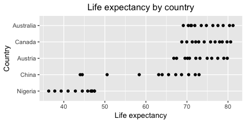

``` r
Gap %>% #This gives an ordered violin plot. Before, Australia was the first and now we have Nigeria being the country with the lowest life expectancy.
  ggplot(aes(country, lifeExp, fill = country)) +
  scale_y_log10() +
  geom_violin() +
  labs(x="Country", y = "Life expectancy") +
  ggtitle("GDP per capita by country")+theme(plot.title = element_text(hjust = 0.5))
```

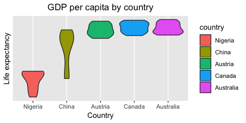

### Write and read the `Gap` data frame as a `csv`.

``` r
write_csv(Gap, "Gap.csv") #This chunk code writes data to file
```

Read this Gap csv, saving it to `mydata`:

The csv file do not preserve the ordering when imported. The `csv` does not survive the round trip of writing to file then reading back in.

``` r
mydata <- read_csv("Gap.csv")
```

    ## Parsed with column specification:
    ## cols(
    ##   country = col_character(),
    ##   continent = col_character(),
    ##   year = col_integer(),
    ##   lifeExp = col_double(),
    ##   pop = col_integer(),
    ##   gdpPercap = col_double()
    ## )

``` r
head(mydata) %>% knitr::kable()
```

| country   | continent |  year|  lifeExp|       pop|  gdpPercap|
|:----------|:----------|-----:|--------:|---------:|----------:|
| Australia | Oceania   |  1952|    69.12|   8691212|   10039.60|
| Australia | Oceania   |  1957|    70.33|   9712569|   10949.65|
| Australia | Oceania   |  1962|    70.93|  10794968|   12217.23|
| Australia | Oceania   |  1967|    71.10|  11872264|   14526.12|
| Australia | Oceania   |  1972|    71.93|  13177000|   16788.63|
| Australia | Oceania   |  1977|    73.49|  14074100|   18334.20|

``` r
mydata %>%
  ggplot(aes(lifeExp, country)) +
  geom_point() +
  labs(x="Life expectancy", y = "Country") +
  ggtitle("Life expectancy by country")+theme(plot.title = element_text(hjust = 0.5))
```


``` r
identical(Gap,mydata) #The written data and the imported data are not the same.
```

    ## [1] FALSE

### Write and read the `Gap` data as `RDS`:

The order is preserved when `RDS` is used.

``` r
saveRDS(Gap, "Gap.rds")
```

Read this Gap RDS, and saving it to `mydata2`:

The rds file does preserve the ordering when imported.

``` r
mydata2 <- readRDS("Gap.rds")
head(mydata2) %>% knitr::kable()
```

| country   | continent |  year|  lifeExp|       pop|  gdpPercap|
|:----------|:----------|-----:|--------:|---------:|----------:|
| Australia | Oceania   |  1952|    69.12|   8691212|   10039.60|
| Australia | Oceania   |  1957|    70.33|   9712569|   10949.65|
| Australia | Oceania   |  1962|    70.93|  10794968|   12217.23|
| Australia | Oceania   |  1967|    71.10|  11872264|   14526.12|
| Australia | Oceania   |  1972|    71.93|  13177000|   16788.63|
| Australia | Oceania   |  1977|    73.49|  14074100|   18334.20|

``` r
mydata2 %>% #the scatterplot
  ggplot(aes(lifeExp, country)) +
  geom_point() +
  labs(x="Life expectancy", y = "Country") +
  ggtitle("Life expectancy by country")+theme(plot.title = element_text(hjust = 0.5))
```


``` r
mydata2 %>% #the violin plot
  ggplot(aes(country, lifeExp, fill = country)) +
  scale_y_log10() +
  geom_violin() +
  labs(x="Country", y = "Life expectancy") +
  ggtitle("GDP per capita by country")+theme(plot.title = element_text(hjust = 0.5))
```


``` r
identical(Gap,mydata2) #The written data and the imported data are the same.
```

    ## [1] TRUE

### Write and read the `Gap` data frame using `dput`:

The order is preserved when `dput/dget` is used.

``` r
dput(Gap, "Gap.txt")
```

Read in data, saving it to `mydata3`:

The txt file also preserves the ordering when imported.

``` r
mydata3 <- dget("Gap.txt")
head(mydata3) %>% knitr::kable()
```

| country   | continent |  year|  lifeExp|       pop|  gdpPercap|
|:----------|:----------|-----:|--------:|---------:|----------:|
| Australia | Oceania   |  1952|    69.12|   8691212|   10039.60|
| Australia | Oceania   |  1957|    70.33|   9712569|   10949.65|
| Australia | Oceania   |  1962|    70.93|  10794968|   12217.23|
| Australia | Oceania   |  1967|    71.10|  11872264|   14526.12|
| Australia | Oceania   |  1972|    71.93|  13177000|   16788.63|
| Australia | Oceania   |  1977|    73.49|  14074100|   18334.20|

``` r
str(mydata3)
```

    ## Classes 'tbl_df', 'tbl' and 'data.frame':    60 obs. of  6 variables:
    ##  $ country  : Factor w/ 5 levels "Nigeria","China",..: 5 5 5 5 5 5 5 5 5 5 ...
    ##  $ continent: Factor w/ 5 levels "Africa","Americas",..: 5 5 5 5 5 5 5 5 5 5 ...
    ##  $ year     : int  1952 1957 1962 1967 1972 1977 1982 1987 1992 1997 ...
    ##  $ lifeExp  : num  69.1 70.3 70.9 71.1 71.9 ...
    ##  $ pop      : int  8691212 9712569 10794968 11872264 13177000 14074100 15184200 16257249 17481977 18565243 ...
    ##  $ gdpPercap: num  10040 10950 12217 14526 16789 ...

``` r
mydata3 %>%
  ggplot(aes(lifeExp, country)) +
  geom_point() +
  labs(x="Life expectancy", y = "Country") +
  ggtitle("Life expectancy by country")+theme(plot.title = element_text(hjust = 0.5))
```


``` r
mydata3 %>% #the violin plot
  ggplot(aes(country, lifeExp, fill = country)) +
  scale_y_log10() +
  geom_violin() +
  labs(x="Country", y = "Life expectancy") +
  ggtitle("GDP per capita by country")+theme(plot.title = element_text(hjust = 0.5))
```


``` r
identical(Gap,mydata3) #The written data and the imported data are the same.
```

    ## [1] TRUE

PART3: Visualization design:
----------------------------

### Replotting the ordered data here.

Here we replotted the ordered data with the `theme` command and `colour` included. The code here give the life expectancy of each country for the given years.

``` r
ggplot(Gap, aes(year, lifeExp)) +
     facet_wrap(~ country) +
     geom_point() +
     labs(x = "Country",
          y = "Life expectancy",
          title = "Yearly life expectancy of 5 countries") +
  theme_bw() +
  theme(axis.text = element_text(size=13),
          strip.background = element_rect(fill = "grey"), #colours the stripe grey 
          panel.background = element_rect(fill = "lightyellow")) #colours the background of the page.
```

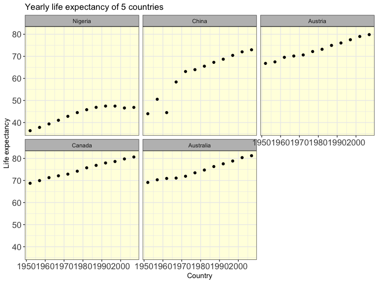

### Making the plot look better

I copied code from homework2 here: From my previous homework, I didn't adjust the stripe text, colour and size. Also, I did not do anything to the panel and the plot size. Similarly, my plot has no label.

``` r
ggplot(data=gapminder) +
  geom_point(mapping = aes(lifeExp, gdpPercap, color = continent)) + 
  facet_wrap(~ continent, scales = "free_x") +
  scale_y_log10()
```

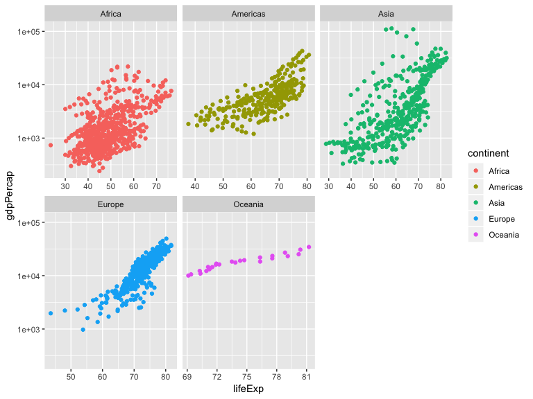

Here I am remaking the previous figure above in the light of something we learned in the recent class meetings about visualization design and color using `RColorBrewer`. With the code below, we are able to adjust the plot to suit its purpose. The `theme_bw` makes the points more obvious and easier to see as opposed to the previous one. This plot adjusted the stripes, colour and include the `dollar` sign. In general, I find the below plot more informative than the previous one.

``` r
RColorBrewer::display.brewer.all()
```

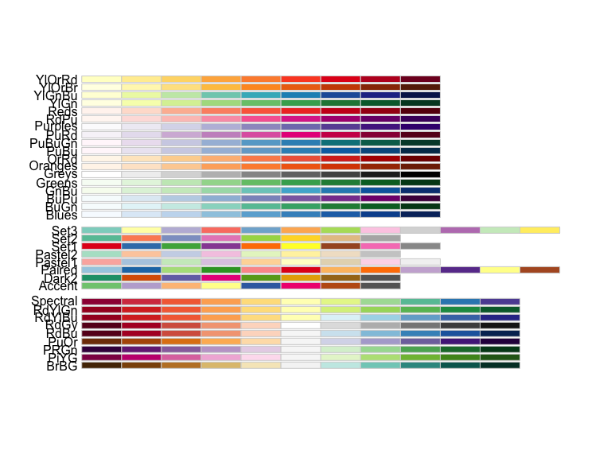

``` r
library(scales)

gg2_plot <- ggplot(data=gapminder) +
  geom_point(mapping = aes(gdpPercap, lifeExp, color = continent), alpha = 0.3) + 
  facet_wrap(~ continent) +
  scale_x_log10(labels=dollar_format()) +
  labs(x = 'GDP per capita', y = 'Life expectancy', title = 'GDP by life expectancy') +
  theme_bw() + #give the panal background
  theme(axis.title=element_text(size=13,face="bold"), #increase the size of the axis title
        axis.text = element_text(size=10), #increase the size of the axis text
          strip.background = element_rect(fill = "grey"), #colour the strip background with grey colour
        strip.text = element_text(size = 13)) + #increase the size of the strip text 
  scale_color_manual(values = continent_colors) +
  theme(
    plot.title = element_text(hjust = 0.5), #position the title at the middle
    legend.position = "none" #remove legend
    )
gg2_plot
```

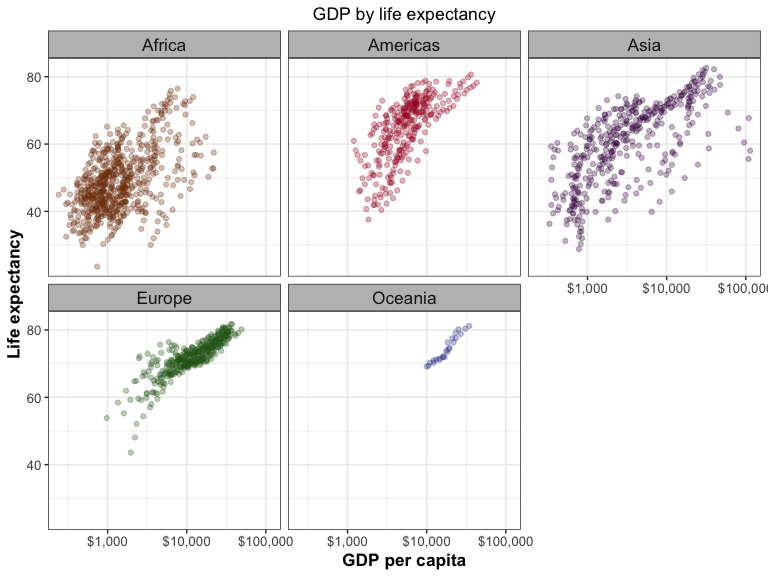

### Convert `gg2_plot` to a `plotly` graph

The code here converts the `ggplot` to `plotly`. With `plotly` as opposed to `ggplot`, you can click on the plot and zoom in and out, pan, reset scale, download the plot as png, see both the value of life expectancy and gdpPercap when you click on a point, and a whole lots more with plotly. But please note that I have commented this out so as to have a markdown file.

``` r
#ggplotly(gg2_plot)
```

PART4: Writing figures to file:
-------------------------------

#### Use `ggplotly` to write a figure to file

The command here converts the `ggplot` to `plotly` and then save the `.html` plot to file since `ggsave` won't work with plotly but you can use saveWidget. I have also commented this out so as to have a markdown file.

``` r
#gg2_plot %>%
  #ggplotly() %>%
  #htmlwidgets::saveWidget(file = "graph.html") 
```

#### Use `ggsave` to write a figure to file

Here I have saved the `gg2_plot` to file as `my_plot1.png`, `my_plot2.png`, `my_plot3.png`, `my_plot4.png`, `my_plot5.png`, `my_plot6.png`.

``` r
ggsave("my_plot1.png", gg2_plot) # default width and height
```

    ## Saving 7 x 5 in image


#### Explicit provision of the plot object `gg2_plot`.

We need to specify the `(..., plot = p)` to have the susbsequent plot saved to file. It won't be saved as the latest version of plot if it is not specified.

``` r
ggsave(filename = "./my_plot2.png", plot = gg2_plot, units = "cm", height = 10, width = 15) # specfied width and height
```

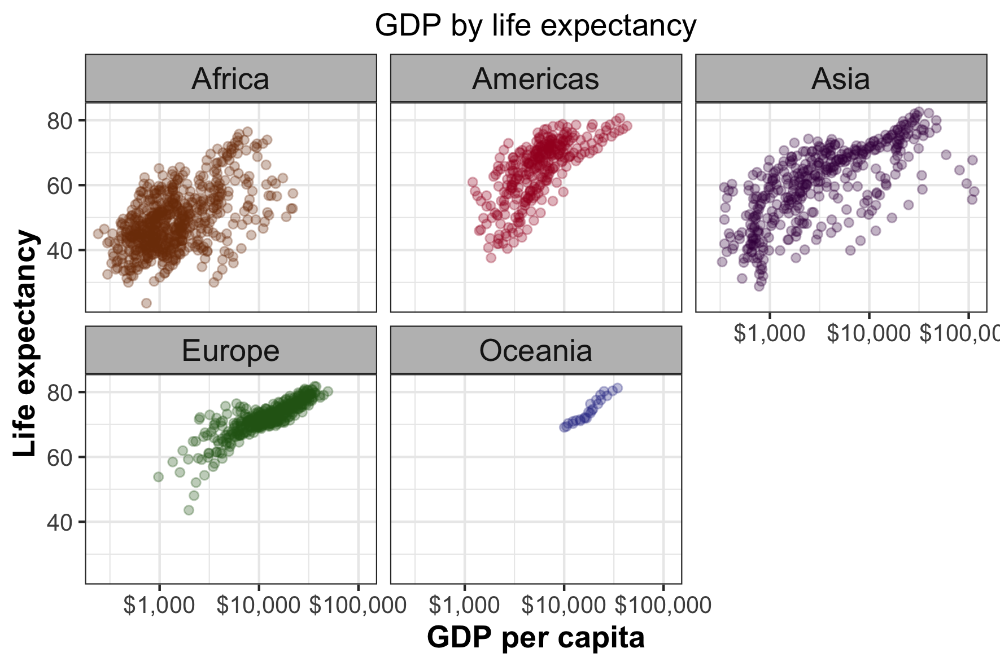

``` r
ggsave("./my_plot3.png", plot = gg2_plot, dpi = 200) # normal resolution
```

    ## Saving 7 x 5 in image

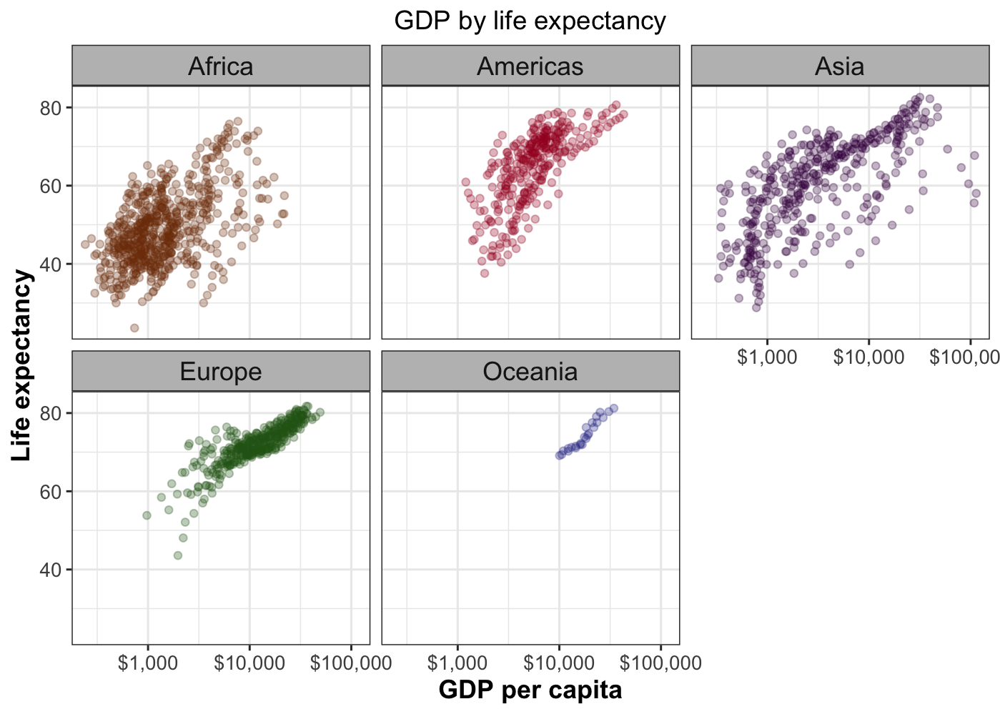

``` r
ggsave("./my_plot4.png", plot = gg2_plot, dpi = 50) # low resolution
```

    ## Saving 7 x 5 in image

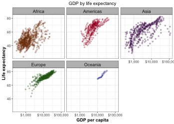

``` r
ggsave("./my_plot5.eps", plot = gg2_plot, device = "eps") # vector format
```

    ## Saving 7 x 5 in image

    ## Warning in grid.Call.graphics(L_points, x$x, x$y, x$pch, x$size): semi-
    ## transparency is not supported on this device: reported only once per page


``` r
ggsave("./my_plot6.bmp", plot = gg2_plot, device = "bmp") # raster format
```

    ## Saving 7 x 5 in image


But I want to do more: Deeper exploration of the forcats packages
-----------------------------------------------------------------

### `fct_infreq()`

The code here rearranged according to the frequency.

``` r
cont <- gapminder$continent

cont %>%
  fct_infreq() %>%
  qplot(fill = cont) +
  labs(x="Continent", y = "Frequency") +
  ggtitle("Frequency of each continents")+theme(plot.title = element_text(hjust = 0.5)) +
  theme_bw()
```

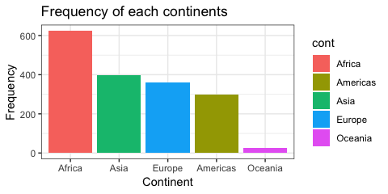

### `fct_rev()`

Here, the arrangement is reversed from the previous one. Levels rearranged in ascending order of frequency.

``` r
cont %>%
  fct_infreq() %>%
  fct_rev() %>%
  qplot(fill = cont) +
  labs(x="Continent", y = "Frequency") +
  ggtitle("Frequency of each continents")+theme(plot.title = element_text(hjust = 0.5)) +
  theme_bw()
```

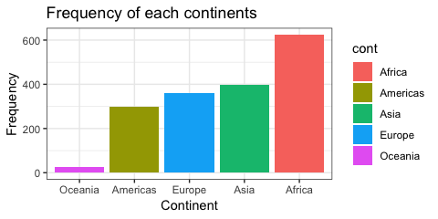

### `fct_reorder2()`

Here, we used the previous countries selected to explore more of the factor level reordering functions.

``` r
sel_countries <- c("Nigeria", "Australia", "Canada", "Austria", "China" ) 


gap_select <- gapminder %>%
  filter(country %in% sel_countries) %>% #the code filters all countries to only selected countries
  droplevels() 

gap_select %>% #this chunk code arranged alphabetically
  ggplot(aes(year, gdpPercap)) +
  geom_line(aes(group=country, colour=country)) +
  labs(x="Year", y = "GDP per capita") +
  ggtitle("GDP per capita by countries in dofferent years")+theme(plot.title = element_text(hjust = 0.5)) +
  theme_bw()
```

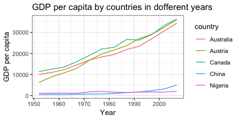

``` r
gap_select %>% #this chunk code arranged by GDP per capita and year.
  mutate(country = fct_reorder2(country, year, gdpPercap)) %>%
  ggplot(aes(year, gdpPercap)) +
  geom_line(aes(group=country, colour=country)) +
  labs(x="Year", y = "GDP per capita") +
  ggtitle("GDP per capita by countries in different years")+theme(plot.title = element_text(hjust = 0.5))
```

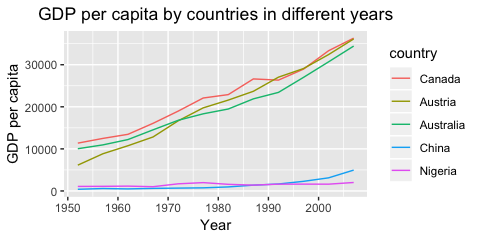

### `fct_relevel()`

The code here put Canada after the first level.

``` r
gap_select$country %>%
  fct_relevel("Canada", after = 1) %>%
  levels() %>%
  head()
```

    ## [1] "Australia" "Canada"    "Austria"   "China"     "Nigeria"

### `fct_recode()`

The code here changed the level Nigeria to Naija.

``` r
gap_select$country %>%
  fct_recode("Can" = "Canada","Naija" = "Nigeria") %>%
  levels() %>%
  head()
```

    ## [1] "Australia" "Austria"   "Can"       "China"     "Naija"

### `fct_collapse()`

The code here collapses three countries `Australia`, `Austria` and `China` into a Combo.

``` r
gap_select$country %>%
  fct_collapse("Combo" = c("Australia","Austria", "China")) %>%
  fct_rev() %>%
  qplot(fill=gap_select$country) +
  labs(x="Country", y = "Frequency") +
  ggtitle("Frequency of each country")+theme(plot.title = element_text(hjust = 0.5)) +
  theme_bw()
```

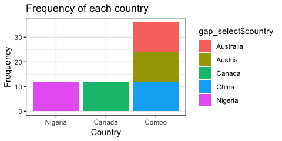

### `fct_lump()`

The code here collapses countries to the same frequencies but keeps the top two frequent level.

``` r
gap_select$country %>%
  fct_lump(n=2) %>%
  levels() %>%
  head()
```

    ## [1] "Australia" "Austria"   "Canada"    "China"     "Nigeria"

``` r
cont %>%
  fct_lump(n=2) %>%
  qplot(fill = cont) +
  labs(x="Country", y = "Frequency") +
  ggtitle("Frequency of each country")+theme(plot.title = element_text(hjust = 0.5)) +
  theme_bw()
```

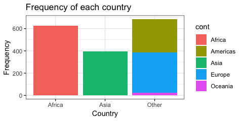

References:
-----------

[R for Data science](http://r4ds.had.co.nz/factors.html)

[STAT545 class exercise12 and note](https://github.com/funkedavid82/Stat545_participation/blob/master/cm012/cm012-exercise.md)

[Jenny's note on factor and reordering](https://www.stat.ubc.ca/~jenny/STAT545A/block05_getNumbersOut.html#reordering-the-levels-of-the-country-factor)

[R programming](http://makemeanalyst.com/r-programming/reading-and-writing-data-to-and-from-r/)
